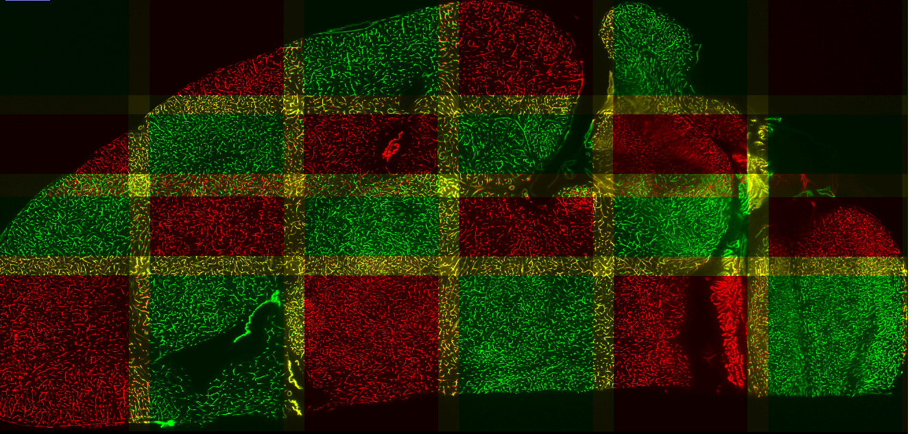

# MosaicExplorerJ
An ImageJ script to align and stitch three-dimensional tiles and quickly explore terabyte-sized microscopy datasets

[Documentation](https://drive.google.com/file/d/1Hn2eJYZr9bDnp0TGWAxc7GBuVuu69H6R/view?usp=sharing)

[Test Datasets](https://drive.google.com/drive/folders/1SykCjqwbJ31qy1QKsWmk6Ro6qxr9oYaa?usp=sharing)

**Emb4_4x5Mosaic_2CAMs_595GB (318 GB compressed)**
4 columns x 5 rows mosaic, 2 camera views. Tiles are stored as series of 2D TIFF files. Should be opened by MosaicExplorerJ with Dual camera ticked to browse both camera views.

**Emb3_2x2_Mosaic_2CAMs_12GB (8 GB compressed)**
3D cropped out volume from a scan, 2 columns x 2 rows mosaic, 2 camera views. Tiles are stored as series of 2D TIFF files. Should be opened by MosaicExplorerJ with Dual camera ticked to browse both camera views.

**Brain2_izq_2x8Mosaic_LeftSide_300GB (300 GB raw)**
Left side (2 columns x 8 rows mosaic) from a dual side scan. Tiles are stored as 3D TIFF images. Should be opened by MosaicExplorerJ with Dual side ticked.
