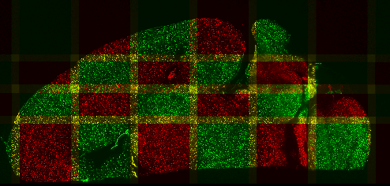

# MosaicExplorerJ
An ImageJ script to align and stitch three-dimensional tiles and quickly explore terabyte-sized microscopy datasets

[Documentation](https://drive.google.com/file/d/1Hn2eJYZr9bDnp0TGWAxc7GBuVuu69H6R/view?usp=sharing)

[Test Datasets](https://drive.google.com/drive/folders/1SykCjqwbJ31qy1QKsWmk6Ro6qxr9oYaa?usp=sharing)
