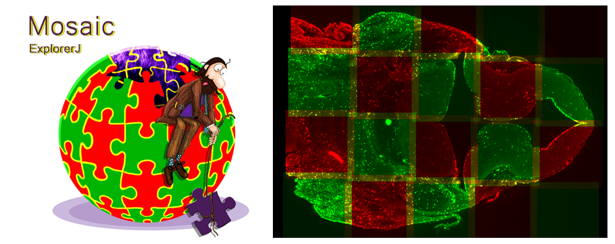

# MosaicExplorerJ
An ImageJ script to align and stitch three-dimensional tiles and quickly explore terabyte-size microscopy datasets.

[Documentation](https://drive.google.com/file/d/19vM4tPypnr9aG2dTaA9363OO9Xrl3vTU/view?usp=sharing)

[Video Tutorials](https://drive.google.com/drive/folders/1D9u2VfKWA5n9ZLIgGOChw68wAa8bkJxR?usp=sharing)

[NEUBIAS Academy Presentation](https://www.youtube.com/watch?t=2875&v=GE4gVN4IYd4&feature=youtu.be)

[F1000 Research Article](https://f1000research.com/articles/9-1308)

[Test Datasets](https://drive.google.com/drive/folders/1SykCjqwbJ31qy1QKsWmk6Ro6qxr9oYaa?usp=sharing)

**Emb4_4x5Mosaic_2CAMs_595GB (318 GB compressed)**
Mouse embryo head, 4 columns x 5 rows mosaic, 2 camera views, dividing nuclei in PH3-A488 fluorescence channel. The 3D tiles are stored as series of 2D TIFF files. The original dataset is 1.19 TB in size (2 fluorescence channels).
Note: should be opened with Dual camera ticked in MosaicExplorerJ to browse both camera views.

**Brain2_izq_2x8Mosaic_LeftSide_300GB (180 GB compressed)**
Mouse brain, left illumination side (2 columns x 8 rows mosaic), Blood vessels in Tomato-Lectin fluorescence channel. The 2D tiles are stored as 3D TIFF images. The original dataset is 1.2 TB (2 sides and 2 fluorescent channels).

**Emb3_2x2_Mosaic_2CAMs_12GB (8 GB compressed)**
Mouse embryo head, 3D cropped out volume from the complete scan (4 columns x 4 rows), 2 columns x 2 rows mosaic, 2 camera views, dividing nuclei in PH3-A488 fluorescence channel. The 3D tiles are stored as series of 2D TIFF files. The original dataset is 866 GB in size (2 fluorescence channels).
Note: should be opened with Dual camera ticked in MosaicExplorerJ to browse both camera views.
